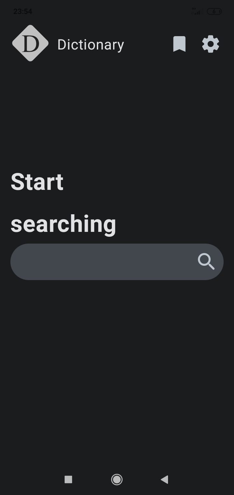
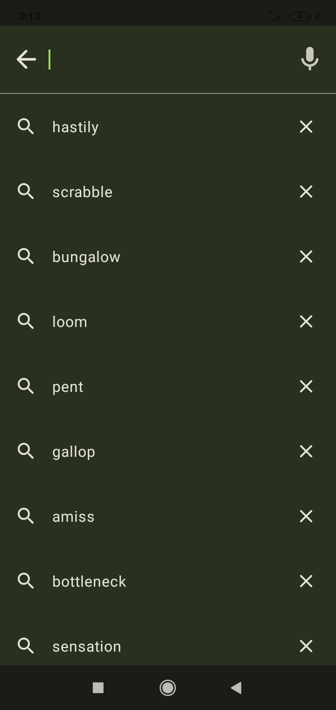
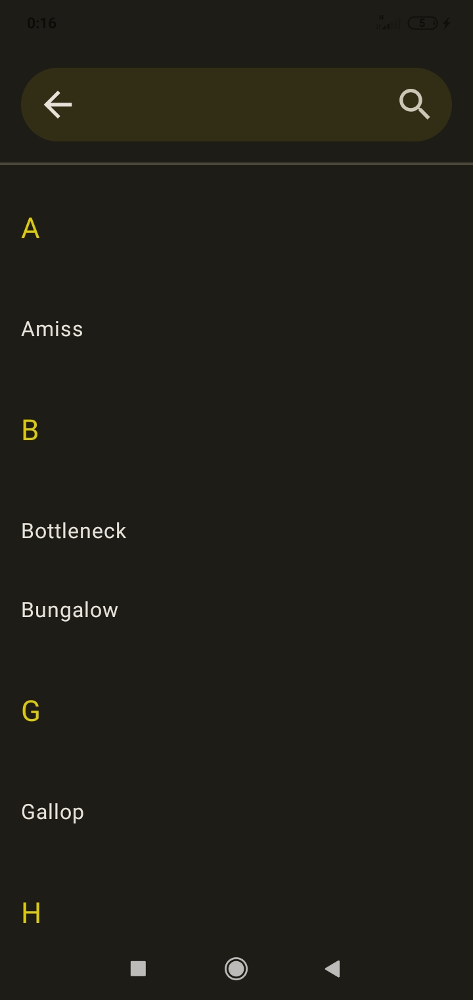
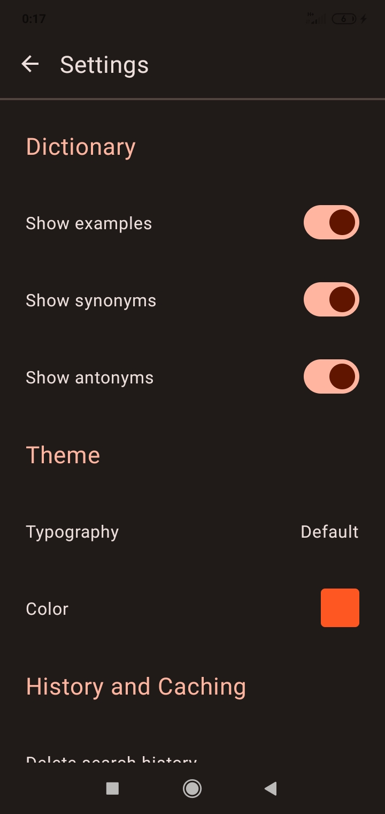

# Dictionary
Jetpack Compose dictionary app using [free dictionary API](https://dictionaryapi.dev/) as API and can cache data for offline use.
## Preview
 
 

## Tech Stacks/ Libraries
1. Jetpack Compose
1. Material 3
1. Multi-Module
1. Retrofit 2
1. Room
1. Datastore
1. Paging 3
1. Hilt
1. Viewmodel
